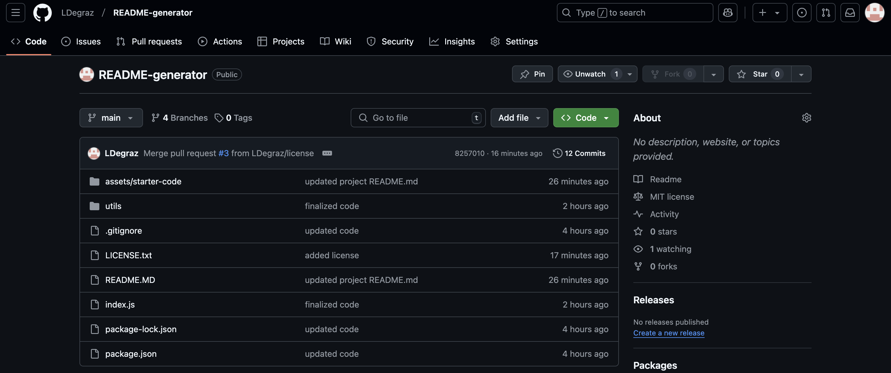
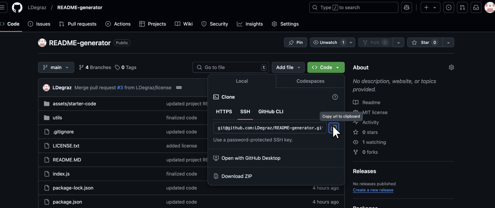
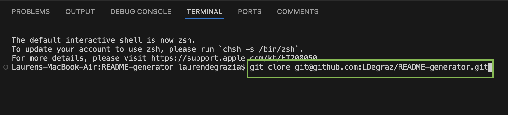
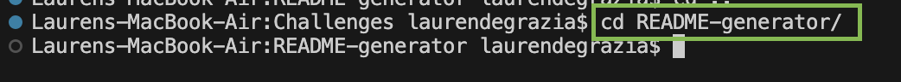
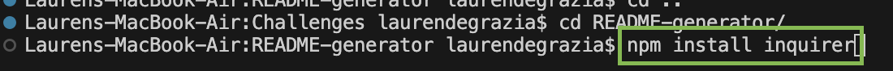
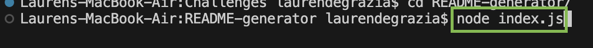
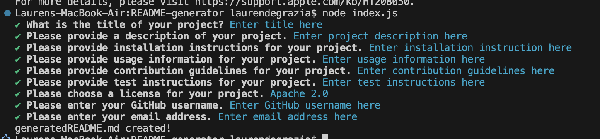
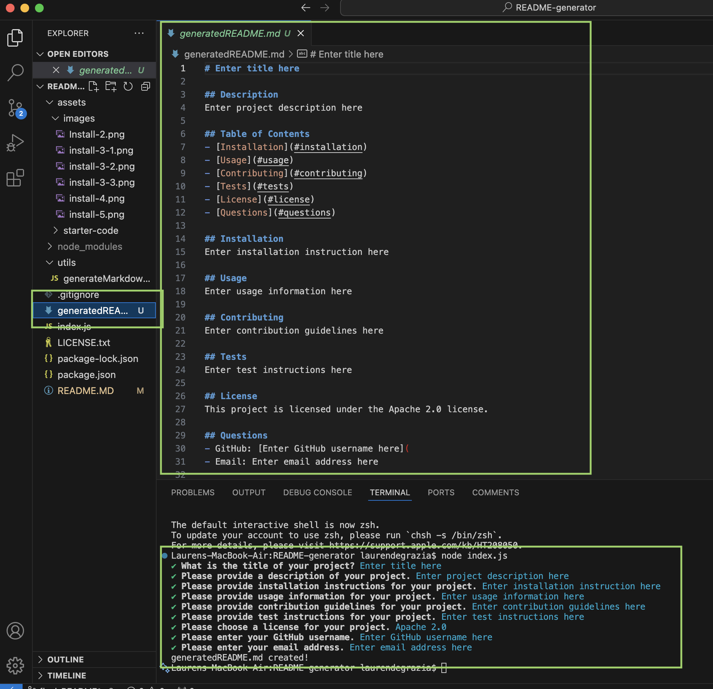
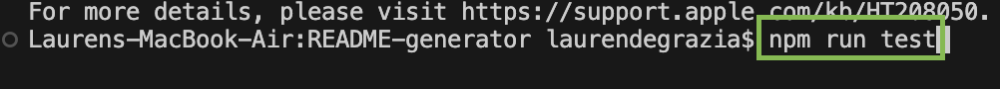

# README Generator
## Description 
**Thanks for choosing README Generator!** This application will create a high-quality README.md for your projects.

## Table of Contents
- [Installation](#installation)
- [Usage](#usage)
- [Test](#test)
- [Contributors](#contributors)
- [License](#license)
- [Questions](#questions)

## Installation
To install this application, please follow the steps below:

1. **Prerequisites:** Please be sure to have the following installed:
- [Node.js](https://nodejs.or/)
- [npm](https://www.npmjs.com/) Node package manager, comes with Node.js

2. **Go to README Generator repo:** 
- [Click here for README Generator Repo](https://github.com/LDegraz/README-generator.git)

    

3. **Copy SSH Key & Clone Repo:**
- Click "code" & copy the SSH key to your clipboard

    

- Go to your local code editor (VS-Cdoe) & paste the SSH key after the command: git clone

    

- Navigate to the project directory using the command: cd README-generator

    

4. **Install Dependencies:**
- **Note: Please be sure you installed the prerequisites in step 1. You will need npm installed for this step**
- Install the required npm package, Inquirer, using the command: npm install inquirer

    

5. **Run the Application:** 
- Start the README Generator by typing the following command in your terminal: node index.js

    

## Usage
[Click here to watch a short video demonstrating how to use the application](https://drive.google.com/file/d/1R47gDt0UXZKJ6vlZXFB1Dh_7QUe4Qiuv/view)

To create your generatedREADME.md file, follow these steps:
1. Complete the step above (Installation section) & run the application with the command: node index.js

    

2. Follow the prompts
- You will input information for 9 prompts: project title, description, installation, usage, contribution, test, license, GitHub username, & email.

    

3. View generatedREADME.md file
- You should see a new file (generatedREADME.md) in your README-generator directory. 
- Open generatedREADME.md & read over your completed README file!

    

## Test
To test this application, you can type the following command into the terminal:
- npm run test

    

## Contributors
- [Lauren DeGrazia](https://github.com/LDegraz/README-generator.git) - Project Creator 
- Starter Code - Inital setup & structure
    - [generatedMarkdown.js](./assets/starter-code/starter-utils/generateMarkdown.js)
    - [index.js](./assets/starter-code/starter-index.js)
    - [package.json](./assets/starter-code/starter-package.json)
- [Inquirer](https://www.npmjs.com/package/inquirer) - A collection of common interactive command-line user interfaces

## License
This project is licensed under the MIT license. See below for details.
### MIT License

Copyright (c) [2024] [Lauren DeGrazia]

Permission is hereby granted, free of charge, to any person obtaining a copy
of this software and associated documentation files (the "Software"), to deal
in the Software without restriction, including without limitation the rights
to use, copy, modify, merge, publish, distribute, sublicense, and/or sell
copies of the Software, and to permit persons to whom the Software is
furnished to do so, subject to the following conditions:

The above copyright notice and this permission notice shall be included in all
copies or substantial portions of the Software.

THE SOFTWARE IS PROVIDED "AS IS", WITHOUT WARRANTY OF ANY KIND, EXPRESS OR
IMPLIED, INCLUDING BUT NOT LIMITED TO THE WARRANTIES OF MERCHANTABILITY,
FITNESS FOR A PARTICULAR PURPOSE AND NONINFRINGEMENT. IN NO EVENT SHALL THE
AUTHORS OR COPYRIGHT HOLDERS BE LIABLE FOR ANY CLAIM, DAMAGES OR OTHER
LIABILITY, WHETHER IN AN ACTION OF CONTRACT, TORT OR OTHERWISE, ARISING FROM,
OUT OF OR IN CONNECTION WITH THE SOFTWARE OR THE USE OR OTHER DEALINGS IN THE
SOFTWARE.

## Questions
If you have any questions, feel free to reach out! 
- **GitHub:** [LDeGraz](https://github.com/LDegraz)
- **Email:** [degrazial3@gmail.com](mailto:degrazial3@gmail.com)
### How to Contact
You can contact me via email for any inquiries or feedback regarding this project. Alternatively, you can open an issue on GitHub if you encounter any problems or have suggestions for improvements. I will do my best to respond promptly!